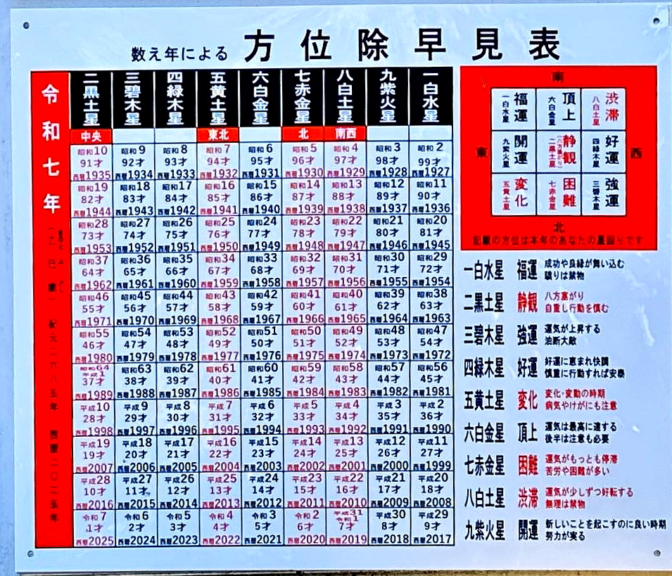
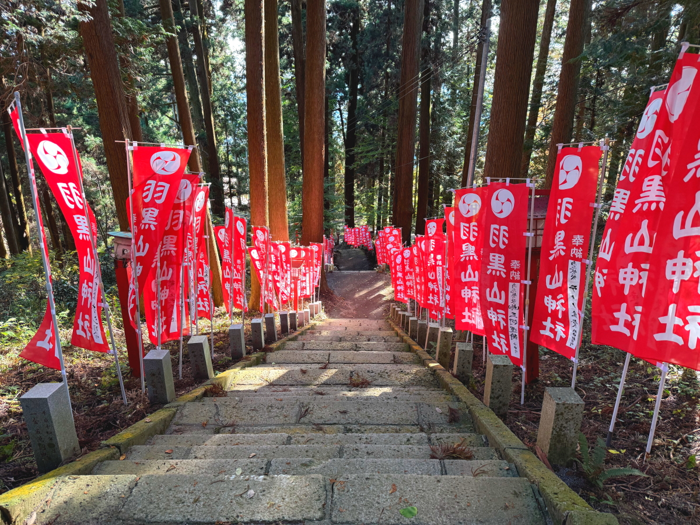
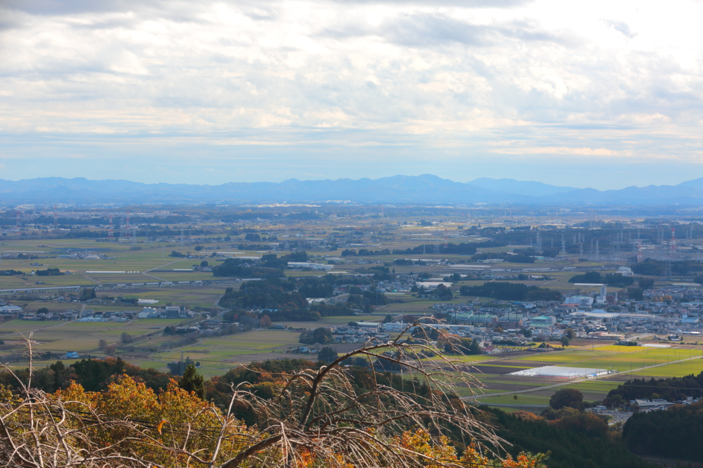
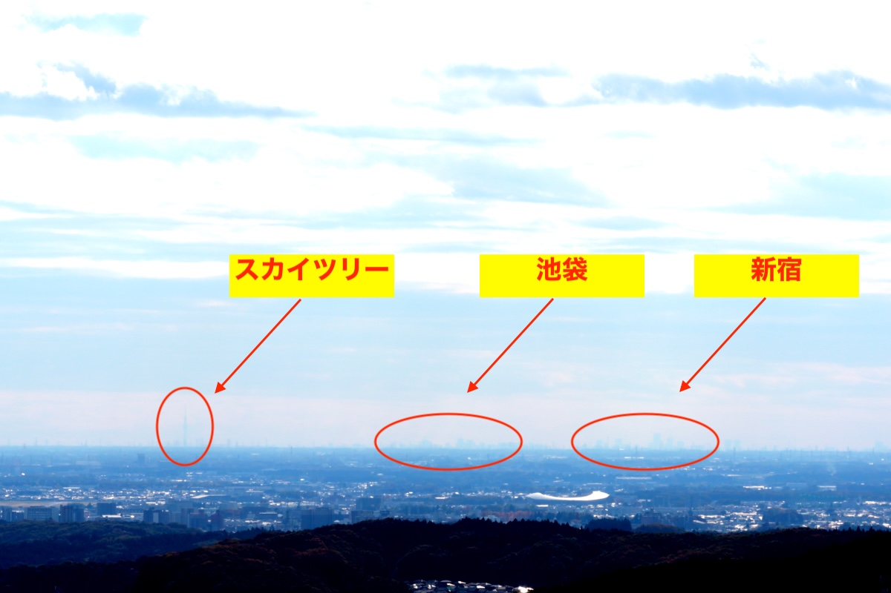

# 20241118_hagurosan

<html>
<head>

<meta charset="UTF-8">
<meta http-equiv="Content-Type" content="text/html; charset=UTF-8">
<meta http-equiv="X-UA-Compatible" content="IE=EmulateIE10" />
<meta http-equiv="X-UA-Compatible" content="IE=edge">

<!--ここから上はお決まりの定型文です-->

<!--ここからが表現の書式などを決めるcssという部分-->

<link href="https://cdnjs.cloudflare.com/ajax/libs/lightbox2/2.7.1/css/lightbox.css" rel="stylesheet">

</head>

<body>

モバイル端末をお使いの場合は、画面を横向きにすると
より見やすくご覧頂けます。

<!--ここ上は、ほぼそのまま使います！-->

<!--QRコードの挿入例-->

 アクセス用QRコード

<marquee direction="left" scrollamount="20" width="30%">(^_^)/~hada</marquee>

<!--流れ文字の挿入例-->
<h1><marquee behavior="left">!!! 2024/11/18 、タイへのお出かけに先立ち、羽黒山にお参り !!!</marquee></h1>

<!--上段にパンクズリストを入れる時の例-->
<!--

<a href="https://torokoid.github.io/Mashiko_himawari_4/" target="_blank">2024年8月10日、益子ひまわり祭</a>><a href="https://torokoid.github.io/20240817_hagurosan/" target="_blank">2024年8月17日、羽黒山</a>><a href="https://torokoid.github.io/20240930_hagurosan/" target="_blank">2024年9月30日、羽黒山</a>><a href="https://torokoid.github.io/20241003_cluster/" target="_blank">10月3日、Cluster Accelerator</a>><a>羽田さんの悠々自適な１カ月を根掘り葉掘りする会@ふくわうち</a>

-->
                          

<!--ここから下が、本体部分-->

<h2>登山口直前で見つけた、銀杏が綺麗！</h2>

<h2>ここから５分ほど登って羽黒山神社に向かいます！</h2>
<iframe width="560" height="315" src="https://www.youtube.com/embed/OgVWspfv_oQ?si=y0ZVfd6P76s_QB2Y" title="YouTube video player" frameborder="0" allow="accelerometer; autoplay; clipboard-write; encrypted-media; gyroscope; picture-in-picture; web-share" referrerpolicy="strict-origin-when-cross-origin" allowfullscreen></iframe>

<h2>羽黒山神社に到着！ 鳥居のクリックでGoogleMapsに飛びます</h2>

<h2>羽黒山と羽黒山神社の由来！</h2>

<h2>鳥居をくぐって、長い階段を登ります！</h2>

<h2>やっとゴールが見えました！</h2>

<h2>実は車でも上がれますが、健常者は車道が使えません！</h2>

<h2>神社のお浄めの水は、山頂からの湧き水です！</h2>

<h2>さっきの車で孫に連れられてきた老夫婦のおばあちゃんと一緒にお参りでした！</h2>

<!--

-->

<h2>令和７年の運勢！</h2>

<h2>お参りも済まし、鐘もついたので、来た道を戻ります！</h2>

<h2>鳥居を出た正面は、関東平野を見渡せる展望台ですが、ここからの眺めは後ほど！</h2>

<h2>山頂のお蕎麦屋さんで、お昼をいただきます！</h2>

<h2>かき揚げそばの大盛りをいただきました。¥1,000-！</h2>

<h2>先ほどの展望台からの眺めです！</h2>

<h2>左は加波山、右は筑波山！</h2>

<h2>茨城との県境の山々！</h2>

<h2>ちょうど空気も澄んできて、地平線上にスカイツリーなどが見えました！</h2>

<h2>小さすぎるので画像を拡大！</h2>

   

<!--

<h2>集合写真！</h2>

-->

   

   

 <!--
<h2>残暑厳しい中、水泳メンバーが集まりました みんな元気そうです では、又の再会を楽しみにしています！</h2>-->

         

  

      

<!--本体はここまで-->

<!--画面に空白地帯を作って、背景が見えるようにしています-->
                                              

<!-- フッタ -->
<footer>

Copyright 2024/11/18 S.Hada

</footer>

<!--HPにさまざまなJavaScriptを呼び込むための書式-->

